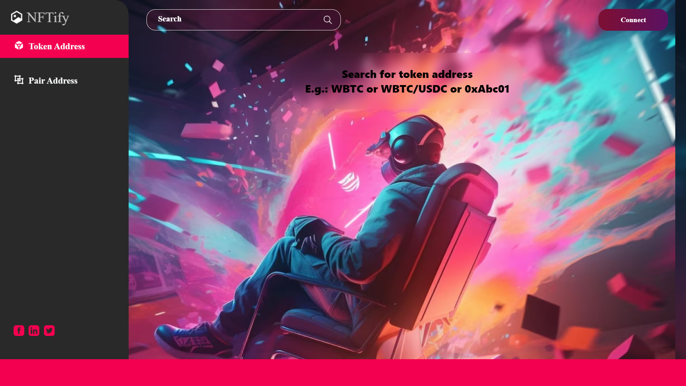
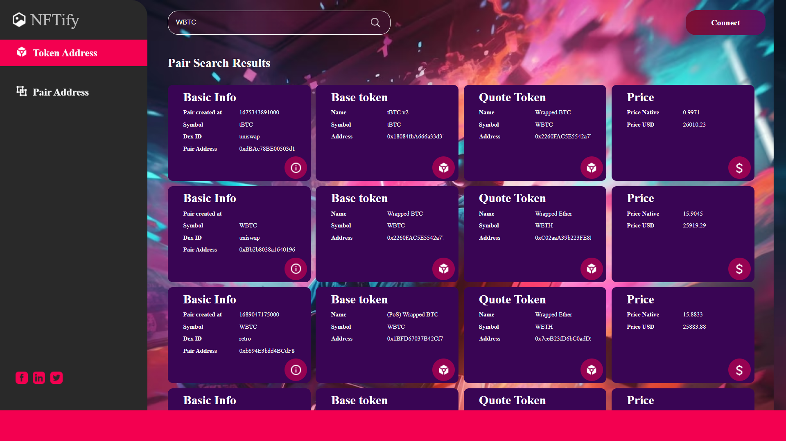
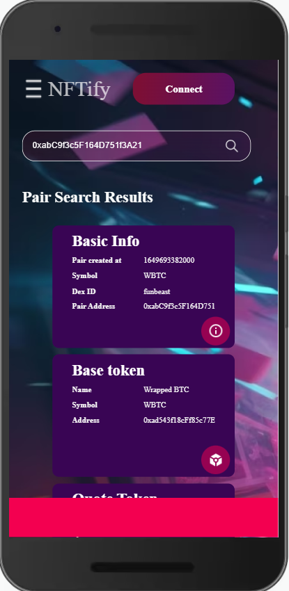
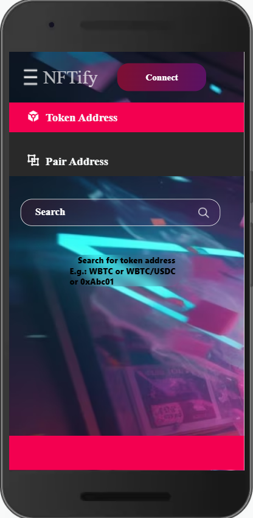

# NFTify Web Application

NFTify is a responsive web application that provides information about pair addresses and token addresses on a decentralized exchange. Users can search for both pair addresses and token addresses using this application.

## Table of Contents

- [About](#about)
- [Features](#features)
- [Getting Started](#getting-started)
- [Usage](#usage)
- [Technologies Used](#technologies-used)
- [Deployment](#deployment)
- [Contributing](#contributing)
- [License](#license)

## About

NFTify is a web application designed to help users easily access information related to pair addresses and token addresses on a decentralized exchange. Whether you need to look up a specific pair or token, NFTify makes the process simple and responsive.

## Features

- Search for pair addresses.
- Search for token addresses.
- Responsive design for various screen sizes.

## Screenshots

## Deployment

Deployed Link:-https://the-matrix-lab-assignment-six.vercel.app

## Getting Started

# Clone the repository

git clone https://github.com/Abu1Osama/The_Matrix_Lab_Assignment.git

# Change directory

cd your-repo

# Install dependencies

npm install

# Start the development server

npm start

## Technologies Used

- NFTify is built using the following technologies:

- React
- Axios
- Scss
- Figma

## Usage

1. Open the application in your web browser.
2. Use the search feature to look up specific pair addresses or token addresses.
3. Explore the details and information provided for each pair or token.
